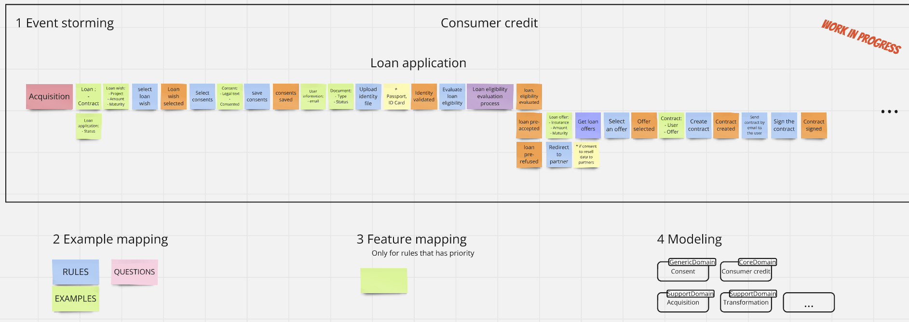

# Goal
This project intent is for me to learn about :
- DDD common pattern and see relation with the database storage of entities
- Make a project ready to use almost already after downloading it
- Make an example of business tests first application where business use case are in the center of the application development

# Subject
A French loan application journey in a company that delivers credit to consumers.

 
# Pre-requisite
- Run "install-dependencies.ps1" in powershell **as administrator** to install
  - .Net 8
  - Docker Desktop

# API launch pre-requisite
- Run Docker Desktop
- Run "launch database.bat"

# Tests launch pre-requisite
- Run Docker Desktop